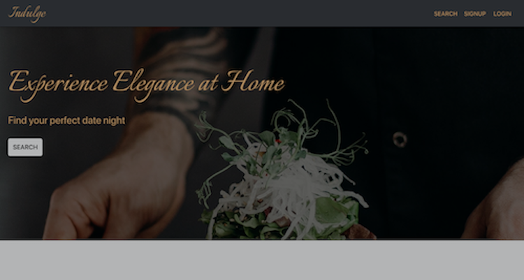
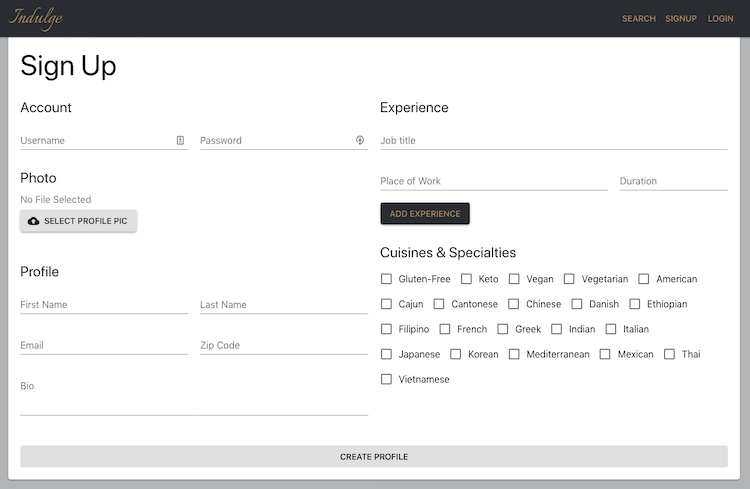
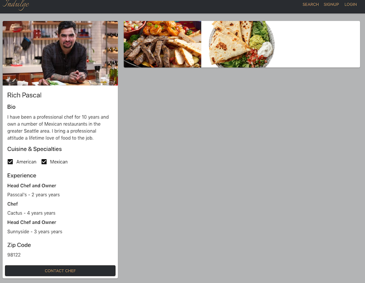

# Indulge

## Description
Indulge is an app for our times that connects out-of-work chefs with consumers who miss their food. The app allows chefs to create profiles to show off their food and industry experience and allows user to search through those chefs by either cusinse, restaurants worked or chef name. 

## Technologies
Indulge is built using the MERN stack. On the back-end we used MongDB with the [Moongoose ORM](https://www.npmjs.com/package/mongoose). On the front-end we supplemented React with [Material-ui](https://material-ui.com/) for it's clean look and easy to use components. The App also uses [Cloudinary](https://cloudinary.com/) and it's API to upload and store photos and the [zipcodebase](https://zipcodebase.com/) API to find zip codes in the users surrounding area. The app is split into a font-end server to host the React app and a back-end server to host the API. The back-end repository can be found [here](https://github.com/artuis/chef-app-backend). 
## Usage
### Chefs 
Click on the chef signup link in the navbar and fill in the username, password, first name, last name, email, zip code and bio fields. You must also include at least one previous indusutry experience. Then select any number of cuisines you can cook or dietary restriction you can accomadate for. Once you signup you will be taken to your profile page where you can upload photos of your workfood and modify your contact information.     

### Consumers
To get started click on the search page. You can you use the select box on the left to pick what type of search you want to perform. Your options are cuisine, which lets you serach for chefs you can cook certain cuisines, restaurant, which lets you search for chefs who have worked at specific restaurants and chef, which lets you search for a chef by name. You can then enter a zipcode so the results can be narrowed down to just your region. The search field on the far right is where you enter your search term and the search button will carry out the search. Once you have searched for something the page will populate with chefs who match the search criteria. Simply click on one of the chef cards to be taken to the chefs profile page where you can view photos of their food and their contact information.

## Team
- [Maged Abdelsalam](https://github.com/magedabdelsalam)
- [Scott Dancer](https://github.com/ScottDancer)
- [Mercury Springberry](https://github.com/mercspring)
- [Thomas Artuis](https://github.com/artuis)
- [Hao Guan](https://github.com/devtown425)

## Future Work
We would like to add user login, event scheduling and in-app messaging in future updates.

## Questions and Contrubutions
If you have any questiosn about the app or would like to contribute please contact me at: mspringberry＠gmail.com.

## Deployed Site
